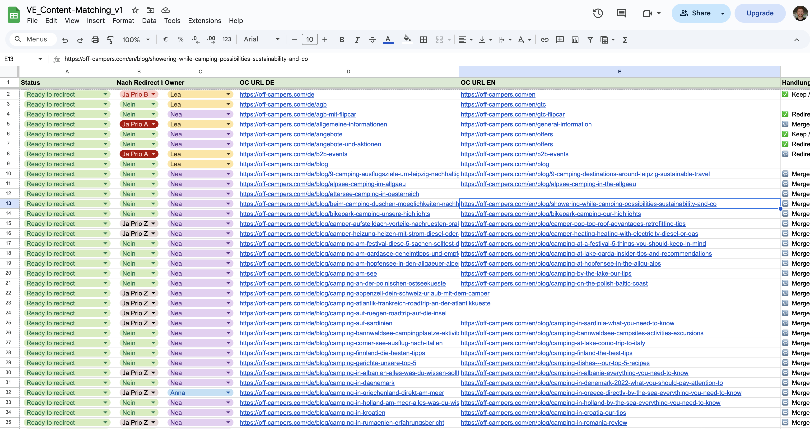
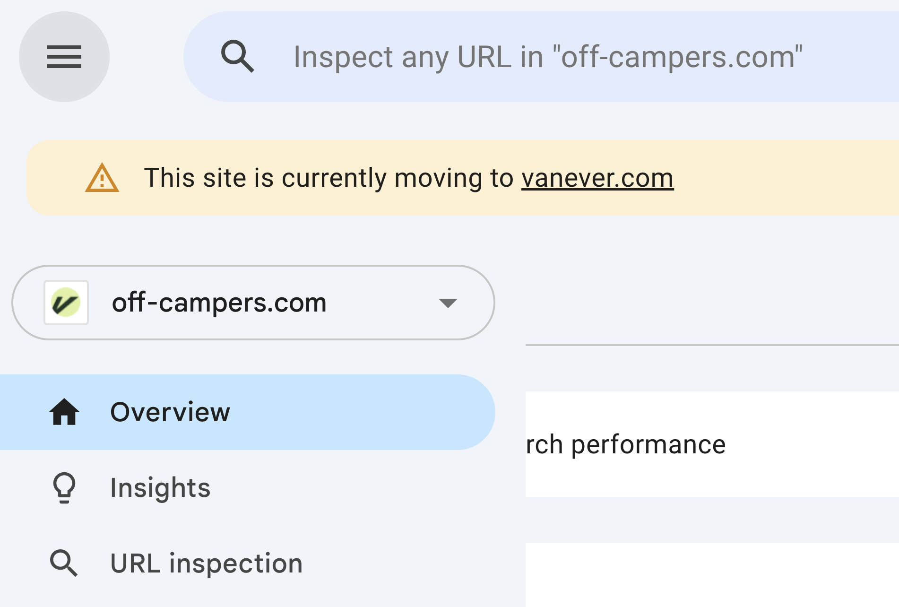
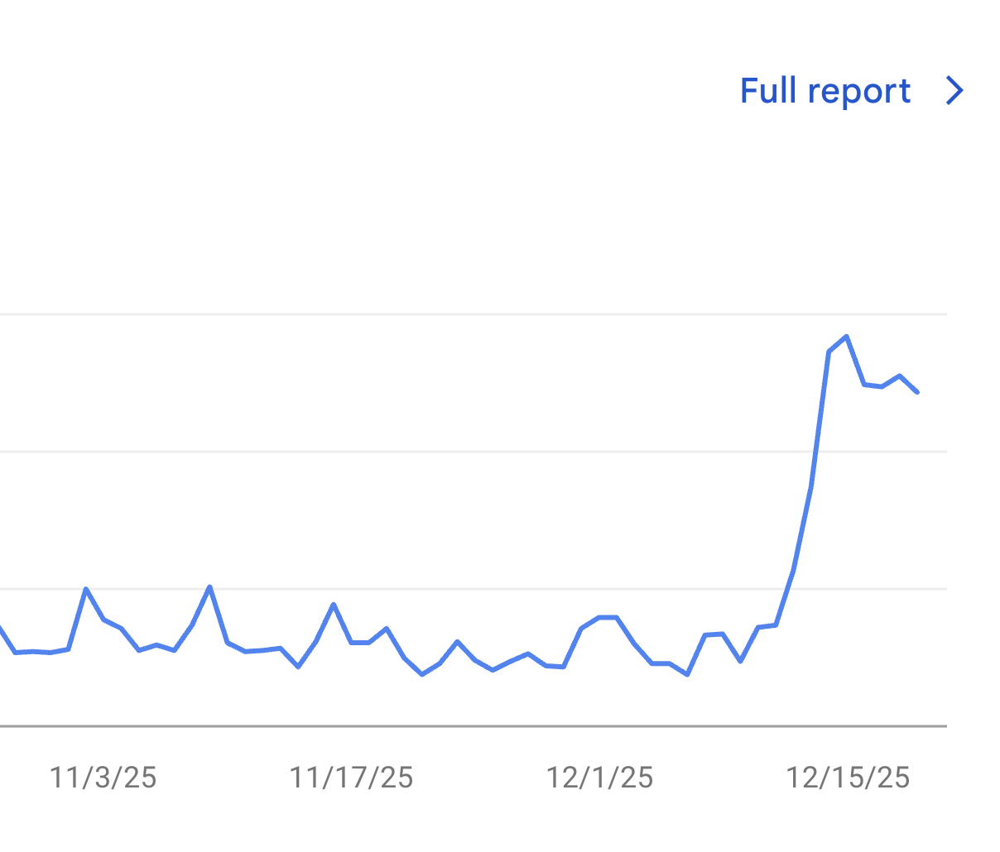

import Alert from "@/components/Alert.astro";

At the beginning of the year, Vanever took over Off-Campers and with it a small portion of the team, the website and proprietary software solutions that had been developed over the previous years.

Immediately after the takeover, we had two websites with different booking systems behind them and quickly realized that we needed to switch to one booking system in the background. So, within a few weeks, we relaunched the Vanever website on the Off-Campers booking system and gave it the distinctive “Off” brand design.

We made our internal tools multi-tenant capable so that we still only had one code base, meaning that changes to it applied directly to both websites. Nevertheless, we still had to manage two separate Content-Management-Systems, which sometimes meant significantly more work (especially for the marketing team).

Although our [ad spend](https://www.adjust.com/glossary/ad-spend/) was only directed at the vanever.com site, organic traffic on the off-campers.com site was significantly higher. This was, of course, due to the considerably higher brand awareness, but also because the off-campers.com site had [the camping blog](https://vanever.com/de/blog) that many people still visit and that we didn't want to simply duplicate on the Vanever site.

## Why the redirect?

In the middle of the year, we reevaluated whether we should operate two websites. Since hardly any organic bookings were coming in via off-campers.com anymore, and in order to minimize maintenance costs and strengthen the Vanever brand, we decided to only operate the Vanever site and to redirect the Off-Campers one to it.

## Planning the redirect

With the help of an external service provider, the marketing team created a pretty big spreadsheet, sorting all Off-Campers pages by importance. Pages that were no longer needed or were out of date were filtered out. These URLs were then mapped to the new URLs that were to be uploaded to the Vanever site. The redirect gave us the opportunity to simplify long and complicated URL slugs, so these were also included. (For example: `/blog/showering-while-camping-possibilities-sustainability-and-co` should redirect to `/blog/showering-while-camping`)



Once the list of nearly 240 URLs was complete, it was our job in the tech team to carry out the redirect.

## Implementing the redirect

### Testing the URLs

Before implementing the redirects, we wanted to ensure that all the URLs from the redirect list were actually reachable. This actually came up during Code Review, where a coworker mentioned, verifying the URLs with a [`HEAD`](https://developer.mozilla.org/en-US/docs/Web/HTTP/Reference/Methods/HEAD) request to check for any 404 errors, would be a good idea.

With the following script, we figured out about 15 broken URLS that needed to be fixed which we then sent back to marketing for review:

```ts filename="index.ts"
import { appendFile } from "node:fs/promises";
import germanSites from "./german-sites.json";
import englishSites from "./english-sites.json";

for (const site of new Set([...germanSites, ...englishSites])) {
  const response = await fetch(site, { method: "HEAD" });
  if (!response.ok) {
    console.error(`Response not okay: ${site}`);
    await appendFile("not-found.txt", `${site}\n`);
  } else {
    console.log(`${site} is reachable.`);
  }
}
```

### Implementing the redirect list

With the help of the redirect list, we were able to use a simple formula to copy all redirects in the correct format directly from the spreadsheet and paste them into our Caddyfile.

For the actual redirects and our webserver, we use [Caddy](https://caddyserver.com/). Here is how one redirect would look like:

```bash filename="Caddyfile.prod"
redir /de/b2b-events https://vanever.com/de/kooperationen 301
```

### Configuring dynamic pages

We also had to handle some dynamic pages specifically, the booking adjustment page. These pages are created dynamically with a random token and needed to be redirected to the new domain while preserving the exact URL structure.

```txt filename="Caddyfile.prod"
@booking_adjustment {
    path_regexp ^\/(en|de)\/booking-adjustment($|\/)
}

redir @booking_adjustment https://vanever.com{uri}
```

<Alert type="info">
  `{uri}` is a Caddy placeholder that represents the entire original request
  URI, including the path and query string. This ensures that when redirecting,
  the full structure of the original URL is preserved in the new location.
</Alert>

### Deploying the changes

After implementing all the redirects in the Caddyfile, we deployed the changes to our production environment. We tested out a few redirects manually to ensure everything was working as expected.

## The "Unindexed" Problem

Because of the way we duplicated the CMS back in January, we knew there were a lot of sites that were set to "noindex" in the vanever CMS. To catch these, we wrote a script to search for unindexed sites after the migration.

We iterated through our list of German and English sites, checking for the `noindex` meta tag.  
We could have also done that in the CMS, but since there were a lot of different page types and collections involved, we decided to do it this way.

```ts
import { appendFile } from "node:fs/promises";
import germanSites from "./german-sites.json";
import englishSites from "./english-sites.json";

for (const site of new Set([...germanSites, ...englishSites])) {
  const siteURL = new URL(site);
  const response = await fetch(siteURL);

  if (!response.ok) {
    console.error(`Response not okay: ${site}`);
    await appendFile("error.txt", `${site}\n`);
  }
  const body = await response.text();

  const headTag = body.substring(
    body.indexOf("<head>"),
    body.indexOf("</head>"),
  );

  if (headTag.includes(`<meta name="robots" content="noindex"/>`)) {
    await appendFile("non-indexed.txt", `${site}\n`);
  }

  await new Promise((resolve) => setTimeout(resolve, 1000));
}
```

We found a few pages that needed manual adjustment and activated the indexing accordingly.

## Telling Google

Now all that remained was to let Google know about the redirect. This was easy to do using the [“Change of Address”](https://support.google.com/webmasters/answer/9370220?hl=en) tool.



## Conclusion

After two weeks of monitoring, we can say that everything is working pretty good. Google has already processed most of the redirects, and the indexed pages for `off-campers.com` are steadily decreasing while those for `vanever.com` are spiking.


